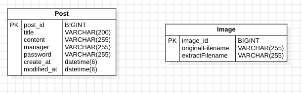
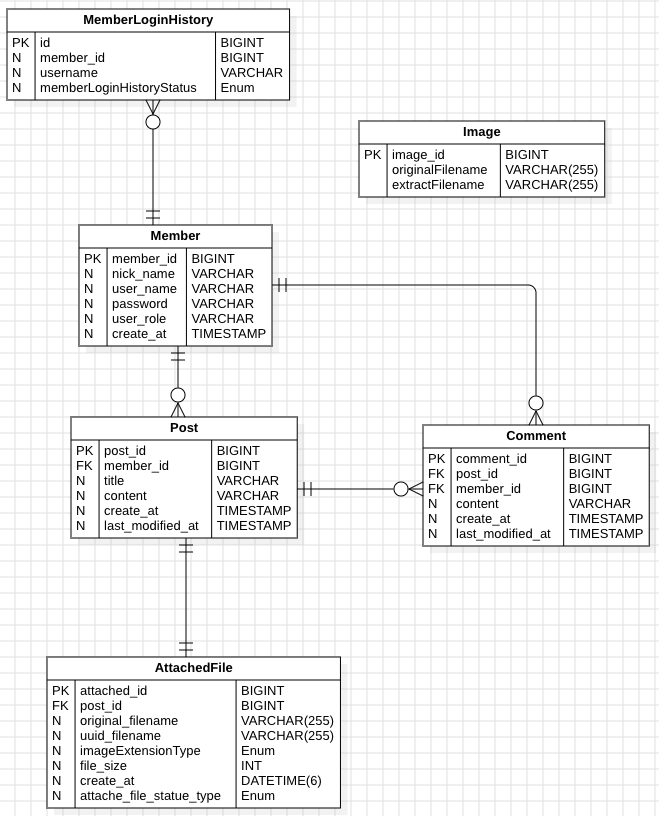
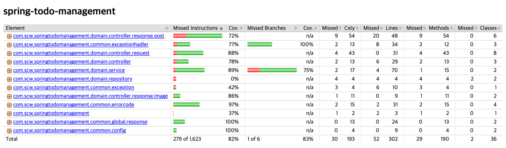
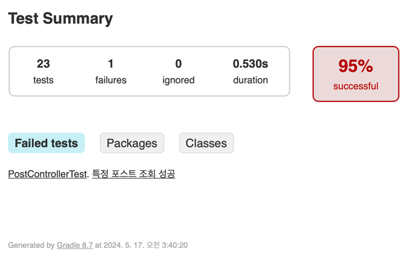

# 필독
- 해야 할 일 `post` 
- 이미지 `Image`
- 요구사항 이 외에 추가 사항
  - 담당자의 이메일은 `gamil.com`, `naver.com`, `github.com` 도메인으로만 게시글을 작성할 수 있다.
  - 비밀번호는 숫자, 문자, 특수문자를 포함한 8자 이상 게시글을 작성할 수 있다.
  - 테스트용 이미지는 `resources/image/` 에 `{UUID}.{확장자}`로 저장되어 있다.(InitDB 사용)
  - 이미지 저장 위치는 `resources/image/` 이다.
  - 각 Controller, Service 개층에서 테스트 작성

## PostMan Api 명세서 - 요청 및 응답 결과 정리
https://documenter.getpostman.com/view/19675174/2sA3JT1dNf

## swagger - 프로젝트 실행 후 접속
http://localhost:8080/swagger-ui/index.html#/

### Use-case-Diagram v1

### ER-Diagram v1

### ER-Diagram v2

### Jacoco

> 테스트 코드 작성을 통해서 목표로 잡았던 82%를 성공하였다. 

## 예외 v1
- **공통 예외**
  - GlobalExceptionHandler : 공통 로직 및 하위 handler에서 잡지 못한 예외 처리
  - ValidExceptionHandler : DTO에서 입력 받은 값을 검증 상태 코드 및 에러 메시지는 Enum으로 관리 
  - ApiExceptionHandler : Api 요청에 동작 중 예외가 발생한 경우 handler
- **게시글**
  - **게시글 등록**
    - 필수 요청 정보가 비어있는 경우
    - 지정된 도메인 이 외에 등록
  - **게시글 단건 조회**
    - 등록된 게시물이 없음
  - **게시글 수정**
    - 필수 요청 정보가 비어있는 경우 
    - 비밀번호 불일치
  - **게시글 삭제**
    - 등록된 게시물이 없음
    - 비밀번호 불일치
- **이미지**
  - **이미지 업로드**
    - 지원하지 않는 확장자 (jpg, jpeg, png)
    - 요청 정보에 이미지가 없는 경우
  - **이미지 다운로드**
    - 등록된 이미지 정보가 아닌 경우

## 예외 v2
- `예외 v2`는 `예외 v1`을 포함한 `추가 요구사항`입니다.
- `등록`, `수정`, `삭제` 요청 `header`에 `JWT`가 없거나 만료된 경우
- **로그인**
  - 로그인 요청
    - 필수 요청 정보가 비어있는 경우
    - 회원가입을 하지 않은 회원인 경우
  - **회원가입**
    - 지정된 도메인 이 외에 등록하는 경우
    - 비밀번호의 입력조건이 맞지 않는 경우
  - **댓글**
    - **댓글 등록**
      - 필수 요청 정보가 비어있는 경우
      - 해당 게시글이 작성된 게시글이 아닌 경우
      - 해당 게시글이 삭제된 경우
    - **댓글 수정**
      - 필수 요청 정보가 비어있는 경우
      - 해당 게시글이 작성된 게시글이 아닌 경우
      - 해당 게시글이 삭제 된 경우
      - 수정 권한이 없는 경우
    - **댓글 삭제**
      - 해당 게시글이 삭제 된 경우
      - 삭제 권한이 없는 경우
  - **첨부파일**
    - **첨부파일 등록**
      - 해당 게시글이 삭제 된 경우
      - 해당 게시글을 작성할 권한이 없는 경우
    - **첨부파일 수정**
      - 해당 게시글이 삭제 된 경우
      - 해당 게시글을 수정할 권한이 없는 경우
  